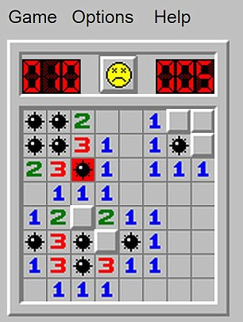

# Minesweeper

This challenge has you create a clone of the desktop game Minesweeper:

Yours will look a little different, but behave in much the same way. The goal is to mark all the mines without setting any off.

## A little help?

We don't want you to have to write the whole game. Your primary goal is to learn more about objects and arrays: how to access properties, how to loop through arrays of objects, and so on.

To help out, we've included two JavaScript files which do most of the heavy lifting for you. We _do not_ expect you to understand everything that's in them! In fact, you should be able to complete the whole challenge without even glancing inside them. (If you want to look, they're in the `lib` directory.)

As you develop your program, you should see little hints appear near the top of the browser window. These are designed to guide you through creating your `board` object. The `board` object is used by the provided code to make the rest of the game work.

